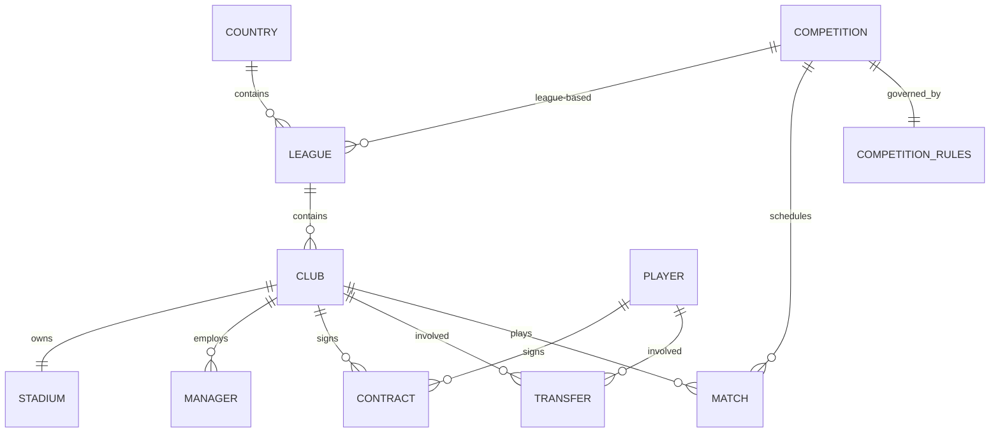

# DATABASE_SPEC — 足球数据库规范

| 项 | 值 |
|---|---|
| 状态 | Draft v0.1（规划阶段，未进入实现） |
| 更新日期 | 2026-09-28 |
| 依据 | 制作流程第 5、6、9 步；项目规则「数据驱动架构 / 唯一ID / 静态与运行时分离 / 数据库独立」 |
| 关联文档 | GAME_DESIGN.md / SIMULATION_SPEC.md / SAVE_SPEC.md / ROADMAP.md |

---

## 0. 文档定位与边界

本文件回答一个问题：**足球世界的数据怎么组织。**

- 本文件定义：实体清单、唯一 ID 策略、静态数据与运行时状态的边界、`.fdb` 数据包结构、版本与兼容性。
- 本文件**不**定义：模拟算法（见 `SIMULATION_SPEC.md`）、存档机制（见 `SAVE_SPEC.md`）、游戏玩法（见 `GAME_DESIGN.md`）。
- 核心红线：**数据库是足球世界的初始配置，不是存档**；**引擎不依赖任何单一数据库**。

### 标记约定

- `[已定]` = 制定者已明确决定。
- `[TBD]` = 会影响数据结构 / 存档兼容 / 引擎接口，**需制定者决策**。
- `[建议]` = 候选方案，未决定。
- **字段级细节在本阶段刻意不写死**（依据第 6 步），只确定实体与关系。

---

## 1. 核心原则 `[已定]`

1. **游戏本体 ≠ 足球数据库**。引擎提供规则与模拟系统，数据库提供足球世界。
2. **数据与逻辑分离**。引擎内不得硬编码具体国家 / 联赛 / 球队 / 球员 / 教练 / 球场 / 赛制 / 转会记录。
3. **唯一且稳定的 ID**。一切持久实体必须有稳定唯一标识；显示名可变更，**不得用作主键**。
4. **静态数据与运行时状态分离**。数据库只承载静态（或初始）数据；运行时变化只进存档。
5. **数据库可独立安装、可替换、可版本化**。同一引擎可加载不同数据库。
6. **导入 / 更换数据库不得覆盖既有存档**。

---

## 2. 实体清单（关系优先，字段后置）

依据第 6 步先确定的关系链：

```
Player → Contract → Club → League → Competition
```

完整实体清单（本阶段仅定"是什么 / 与谁相关"，不定字段）：

| 实体 | 说明 | 关键关系 | 状态 |
|---|---|---|---|
| Country 国家 | 足球世界的地理与国籍基础 | 含 League；是 Player 国籍归属 | `[TBD]` 是否含区域层级 |
| League 联赛 | 积分制赛事容器 | 属于 Country；含 Club | `[TBD]` 是否多层级 |
| Club 球队 | 俱乐部主体 | 属于 League；拥 Player（经 Contract）、Manager、Stadium | `[TBD]` 是否含预备队/青年队 |
| Player 球员 | 球员主体 | 与 Club 经 Contract；有属性、位置、潜力、性格 | `[TBD]` 属性粒度 |
| Manager 教练 | 主教练（及职员） | 属于/执教 Club | `[TBD]` 是否区分普通职员 |
| Stadium 球场 | 比赛与财政载体 | 属于 Club | `[TBD]` 是否含容量对财政影响 |
| Contract 合同 | Player 与 Club 的绑定 | 连接 Player 与 Club | `[TBD]` 是否含奖金条款 |
| Transfer 转会 | 转会记录 | 关联 Player、原 Club、新 Club | `[TBD]` 是初始转会还是含历史 |
| Competition 赛事 | 联赛 + 杯赛的统称 | 含 League / Cup 规则 | `[TBD]` 杯赛建模方式 |
| Match 比赛 | 赛程与结果约束 | 关联两个 Club、赛事 | `[TBD]` 结果进数据库还是存档 |
| Competition Rules 赛事规则 | 赛制、升降级、名额、日程规则 | 被 Competition 引用 | `[TBD]` 规则表达能力边界 |

### 实体关系图（Mermaid）



---

## 3. 唯一 ID 规范

- **原则**：每个持久实体有稳定唯一 ID；**显示名不得作主键**。
- `[建议]` ID 形态：带类型前缀的字符串，如 `cty_`、`lg_`、`clb_`、`ply_`、`mgr_`、`std_`、`ctr_`、`trf_`、`cmp_`、`mat_`；或纯数字 + 类型字段。
  - 优劣待评估（可读性 vs 紧凑性、移动端存储体积）。
- `[TBD]` ID 是否需在**跨数据库**保持一致（例如同一真实球员在两个数据库中的 ID 是否相同）。
  - 影响：数据库合并、Mod 叠加、存档跨库迁移。
- `[TBD]` 运行时"新生代球员"的 ID 分配策略（与 GAME_DESIGN §16 强相关，需保证不重复、可长期生成）。
- **红线**：不得用姓名 / 简称 / 任意可变更字段作为实体引用依据。

---

## 4. 静态数据 vs 运行时状态

这是本文件最关键的边界定义（项目规则第 6、8 条）。

| 类别 | 归属 | 示例（依据项目规则） |
|---|---|---|
| 静态数据 | **数据库 (.fdb)** | 球员姓名、出生日期、国籍、基础属性、俱乐部信息、联赛规则 |
| 运行时状态 | **存档 (Save)** 或运行时内存 | 当前能力、状态、士气、体能、伤病、合同、转会历史、联赛排名、比赛结果、财政、人际关系 |

规则：

- 数据库加载后，运行时**不得**反向写回数据库。
- 存档**必须**保存"相对于数据库的增量 + 引用"，避免整库冗余（具体见 `SAVE_SPEC.md`）。
- `[TBD]` 边界判定规则：当某字段既似静态又会被运行时改动（如"当前能力" vs "基础潜力"），其**归属需逐项裁定**，并在实现前成文。
- `[TBD]` 数据库是否允许含"初始运行时值"（如初始财政、初始合同）——建议允许，但必须标注为初始值而非权威值。

---

## 5. `.fdb` 数据包设计

保留第 6 步的结构思路，**字段细节暂不写死**：

```
2026_27.fdb
├── manifest.json
├── countries.json
├── leagues.json
├── teams.json
├── players.json
├── managers.json
├── stadiums.json
├── competitions.json
├── contracts.json
└── assets/
```

- `manifest.json`：数据库元信息（名称、版本、作者、覆盖范围、引擎兼容版本等）。
- `assets/`：徽章 / 队徽等**非必需**资源；引擎不得假定其存在。
  - `[TBD]` 资源与第三方版权边界（项目规则第 28 条：不得假定真实名称/徽章/肖像可自由分发）。
- `[TBD]` `.fdb` 物理形态：单文件（zip 容器）vs 目录；影响加载、体积、Mod 叠加。
- `[TBD]` `transfers.json`（初始转会）是否列入首个包结构——第 5 步列了"初始转会"，第 6 步示例未含，需统一。
- `[TBD]` 文件切分粒度（单实体单文件 vs 分片）对移动端加载性能的影响。

---

## 6. 数据库版本与兼容性

- **必须版本化**：`.fdb` 带数据库格式版本号，且与引擎兼容性有明确声明。
- `[TBD]` 版本字段结构与语义（数据库版本 / 引擎兼容区间 / 内容版本是否分离）。
- `[TBD]` 兼容策略：
  - 旧数据库 → 新引擎：允许？需迁移？还是拒绝加载并给出诊断？
  - 不一致时**必须报错而非静默**（项目规则第 19 条：指出文件 / 实体 / ID / 字段 / 问题 / 建议修正）。
- `[TBD]` 校验机制：加载时是否做完整性与引用完整性校验（悬空 ID、重复 ID、缺失必填字段）。
  - `[建议]` 必须有，且区分"致命错误"与"可修复警告"。
- **红线**：更换 / 导入数据库**不得自动覆盖现有存档**（见 `SAVE_SPEC.md`）。

---

## 7. 与模拟 / 存档的接口约束

- 引擎通过**统一定义的加载接口**读取数据库，不依赖具体实现（红线）。
- 运行时世界 = 数据库（初始）→ 应用存档增量 → 运行。
- `[TBD]` 加载接口的形态（返回完整内存模型 vs 按需流式加载），影响移动端内存与性能。
- 具体存档如何引用数据库实体，见 `SAVE_SPEC.md`。

---

## 8. TBD 汇总（需制定者决策）

| 编号 | 位置 | 待决问题 | 影响面 |
|---|---|---|---|
| D1 | §2 | 国家是否含区域层级；联赛是否多层级；球队是否含预备/青年队 | 实体模型 |
| D2 | §2 | 球员属性粒度与取值范围 | 数据结构核心 |
| D3 | §2 | 教练与普通职员是否分开建模 | 实体模型 |
| D4 | §2 | 比赛结果/赛程归数据库还是存档 | 静态/运行时边界 |
| D5 | §2 | 杯赛与赛事规则的建模方式与表达能力 | 赛事系统 |
| D6 | §3 | ID 形态；是否跨数据库稳定；新生代 ID 策略 | 合并/Mod/生成器 |
| D7 | §4 | 静态/运行时边界逐项裁定（尤其"当前 vs 基础"类字段） | 存档兼容 |
| D8 | §5 | `.fdb` 物理形态（单文件/目录）；文件切分粒度 | 加载、Mod、性能 |
| D9 | §5 | 初始转会是否入包；assets 版权边界 | 数据包范围 |
| D10 | §6 | 版本字段结构与兼容策略；破坏性变更处理 | 兼容性 |
| D11 | §6 | 加载校验机制与错误分级 | 数据完整性 |
| D12 | §7 | 加载接口形态（全量/流式） | 性能、内存 |

---

## 9. 约束回顾（红线）

1. 引擎内不写死任何真实足球数据。
2. 显示名不得作主键；ID 必须稳定唯一。
3. 数据库只承载静态/初始数据；运行时变化只进存档。
4. 数据库可独立安装、替换、版本化；引擎不依赖单一数据库。
5. 导入/更换数据库不得覆盖存档。
6. 数据错误必须显式报错并给出定位与修正建议，不得静默。
7. 不假定第三方真实资产可自由分发。